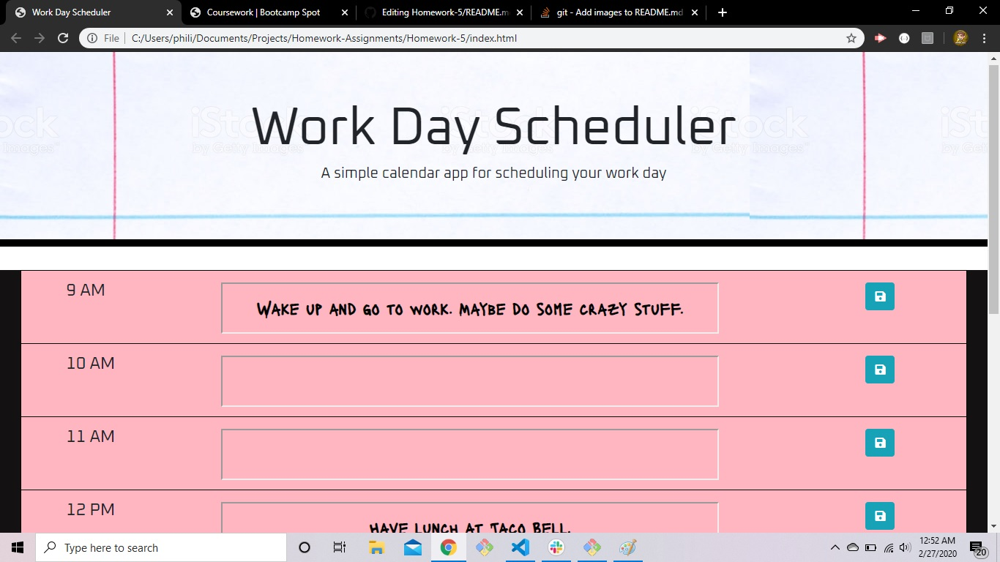
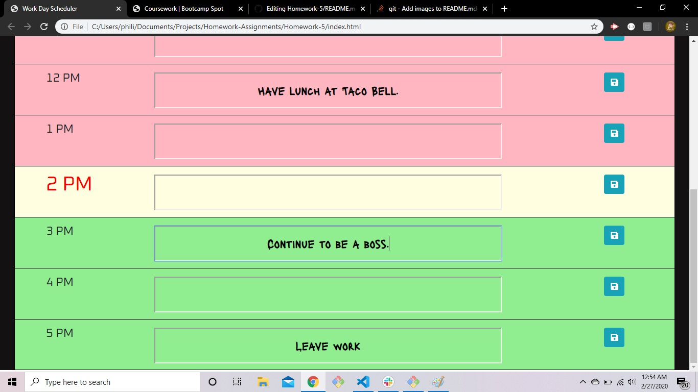

# Homework-5
Day scheduler project for Homework 5.
This homework assignment was a great way for me to hone my skills with simple APIs. I was able to create dynamic styling that was responsive to the API used to find the current time on the user's machine after a bit of troubleshooting.
While I am aware that my code may seem a bit redundant at parts, I ditched a more optimal solution involving more loops in an effort to conserve time to finish the assignment to the best of my ability. 
The deployed application works perfectly and I am very happy with how it turned out.

